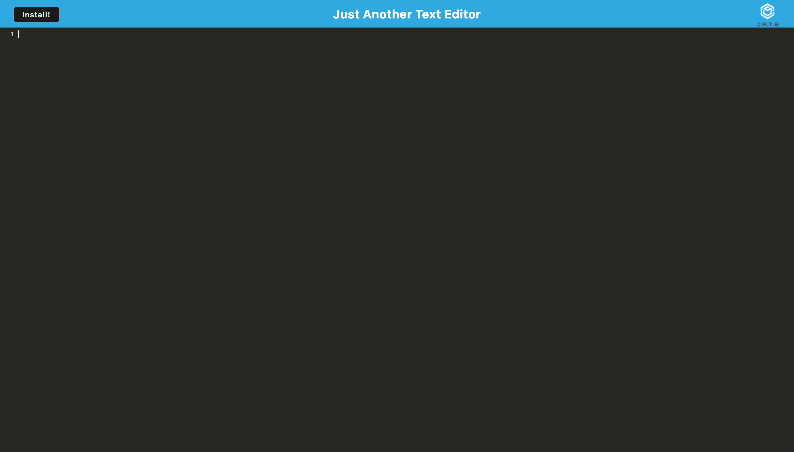

# Text-Editor

## Description

The purpose of this Text Editor is to allow users to use an application with or without internet connection. This is very useful for people who travel a lot or don't have internet.

While building this app, I learned how to use Progressive Web Applications.

## Installation

To install the Text Editor, click on the install button in your browser's search bar. It will then be accessible without internet.

## Usage

To use the Text Editor, you can type anything you want in the space provided and it will be saved to the database.

View the Text Editor <a href="https://one-page-text-editor.herokuapp.com/">here</a>!
